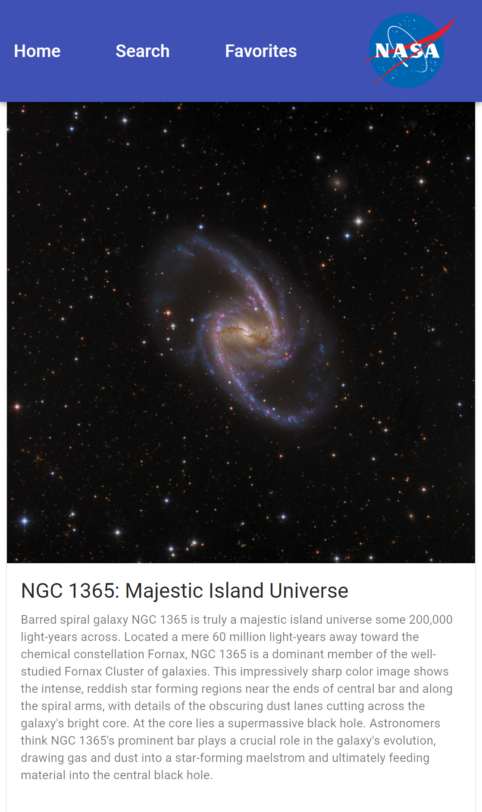
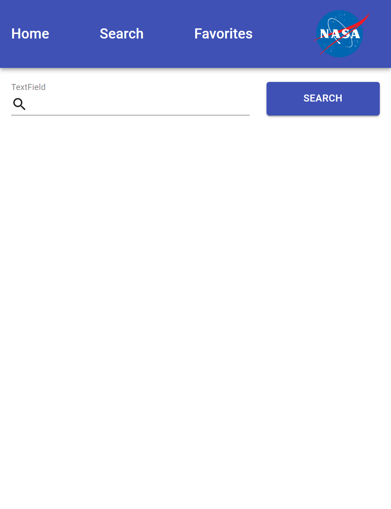
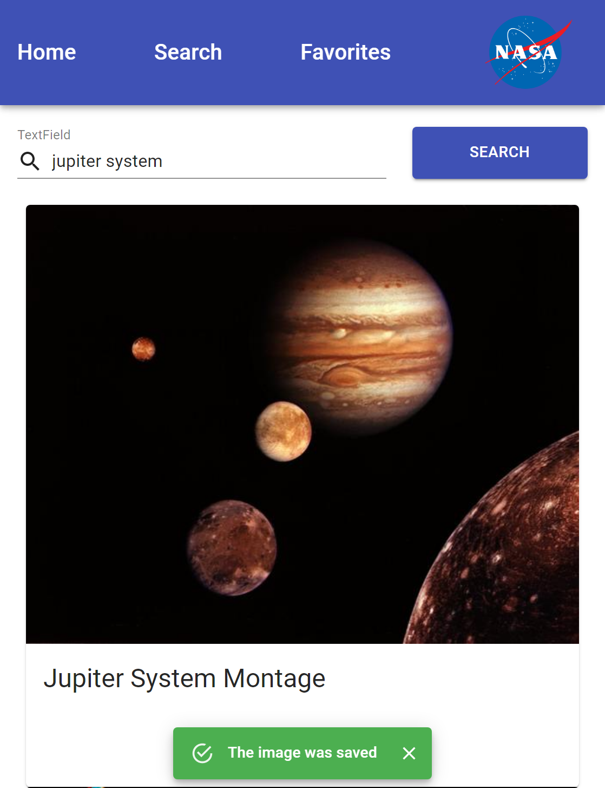
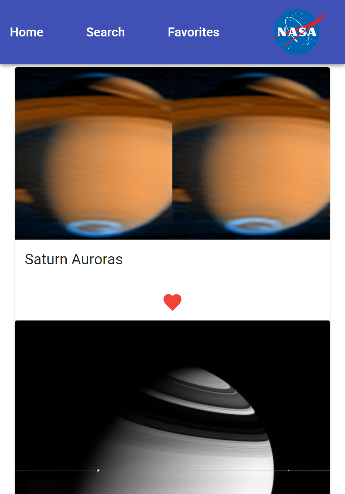
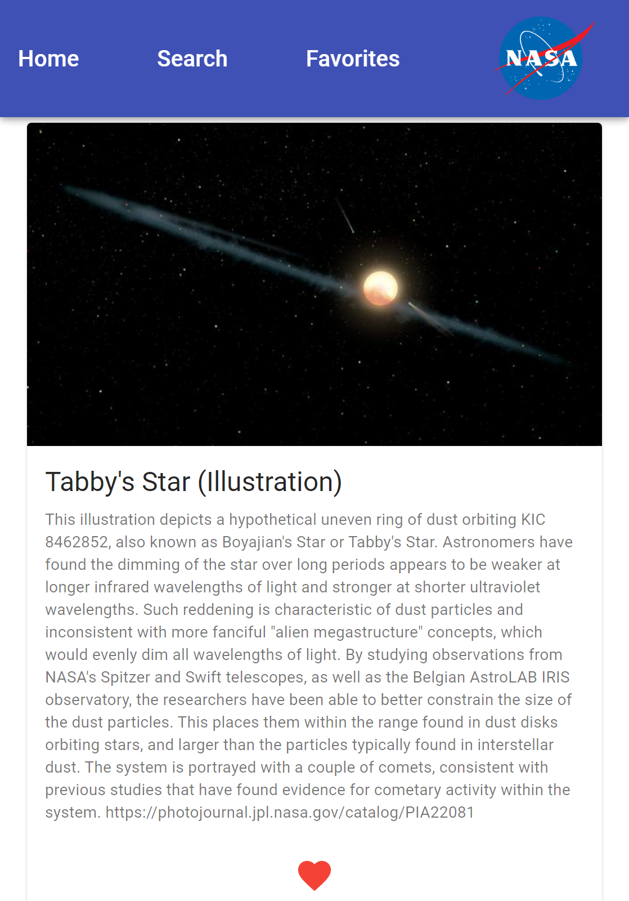
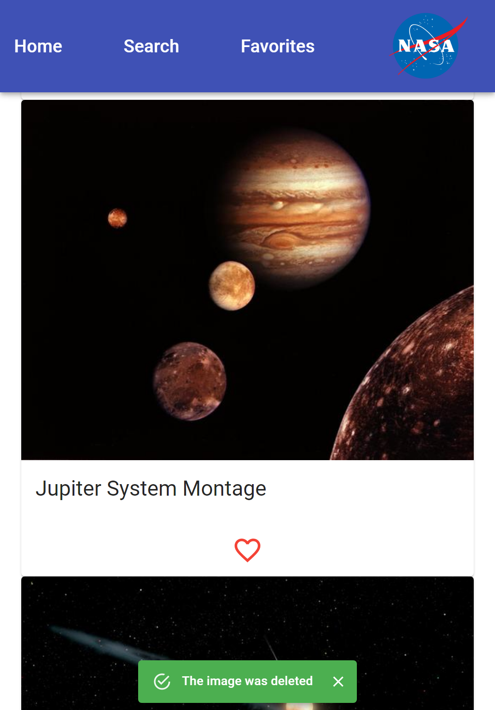

# NASApp Project

A mobile App designed for **Astrophiles** (people who love stars or astronomy). The user can see Astronomy Picture of the Day, search the NASA database, save the favorite result, and see his favorites.

This is a **MERN FullStack Application**.

## project Screenshots
### NavBar 

### home

render data from external API called Astronomy Picture of the Day (APOD) from [NASA](https://api.nasa.gov/) API

### Search

The user can search any keyword and results will be displayed from **NASA Image and Video Library**. If the user liked that image, the image will be added to the favorites in the database. 

### Favorites

Display the favorite images from the Database. The user can see each one separately with its explanation and also delete the image.

## Technology used

- Client-side: React, Material-ui, 
- Server: NodeJs, Express, mongoose
- Database: MongoDB
- External API is [NASA API](https://api.nasa.gov/) which include
    - [APOD](https://apod.nasa.gov/apod/astropix.html): Astronomy Picture of the Day
    - [NASA Image and Video Library](images.nasa.gov)

## Getting Started

- Clone this repository. You will need `node`, `npm` and `MongoDB` installed globally on your machine.
- **Windows:** run `mongod` in the command line 
- run `npm install`
- run `node server` in a terminal
- run `npm start` in another terminal 

